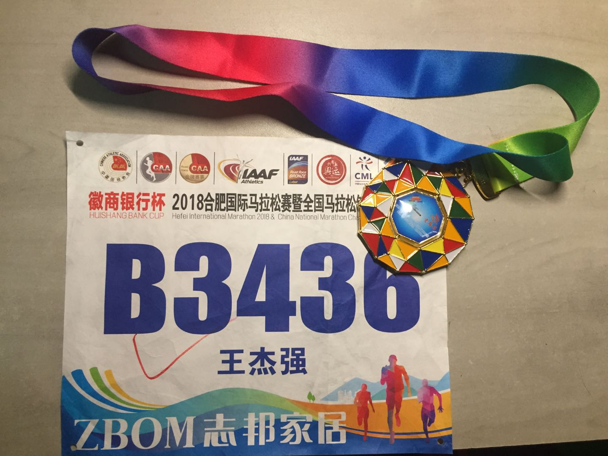

> 一把刀的锋刃是很难越过的，所以智者说得救之道是很难实现的。  

这句被英国作家毛姆引用在其作品《刀锋》扉页上的句子，常常会莫名其妙地，在我拿着吉列剃须刀看着镜子中满脸剃须泡沫的自己时，倏忽间从脑海中蹦出来。很显然，做事情绝对不能分心，尤其又是手动剃须这种本身就具有自残倾向的的行为，最直接的恶果便是几乎每次剃须之后脸上都多了几处可见的伤口。可见别说得救之道是很难实现的，光是完美的剃须之道，就已经足够我伤脑筋的。

伤脑筋总是难免的，可我还是对手动剃须这种行为一往情深。不是说没有体验过电动剃须刀的便捷与安全：开关一打开，剃须刀面开始旋转，下颚胡须与剃须刀摩擦发出嗡嗡的声音，然后不停地切换刀面与面部接触的位置，剃须刀机械地来回游弋，过程充满着文明与工业化的秩序与稳定。但我似乎更加潜意识地喜欢手动剃须刀，那种可能见血的恐惧与期待，在自我保护与自我伤害的矛盾中来回博弈，演变成一种不可名状的快感，最终在剃须结束时达到顶峰。

<!-- more -->

文字似乎有点夸张，但随着年岁的增长，我渐渐地发现了另一个长期压抑甚至是忽视的自己。这个“我”，他好斗，他暴躁，他嗜血，他极不安定，却又渴望完全掌控自己。最重要的是，**他渴望掌控自己。**

琳琅满目的商品，五彩斑斓的食物，花枝招展的美女，暴力血腥的游戏，应接不暇的微信，这个世界有太多太多的诱惑，太多太多的陷阱。在各种琐碎信息和花样广告的轰炸下，如果不想屈服于社会这台巨型绞肉机下，那似乎只能让那个“我”不断强化，以合法的身份，成为真正的我的组成部分。但就像高压锅的小孔放出高温气体一样，也必须找到合适的渠道去间歇式地释放那个“我”所带来的负面能量，这个**渠道就是跑步。**

好吧，上面的都是在胡扯，认真你就输了。不就是跑个步嘛，至于说得那么玄乎？是啊，跑步这么简单的事情，无非就是迈出双脚向前进这个动作的循环执行罢了，哪有什么难度可言。穿上舒服的跑鞋，听上喜欢的音乐，在天气适宜环境优美的条件下，任何健全人都可以跑步，任何健全人都可以成为跑者。**我也只不过是千千万万跑者中的一员罢了。**然而操场的四百米跑道似乎跑个五圈问题不大，这不巧了，公寓旁边的人造湖正好有五公里的塑胶跑道。塑胶跑道好像一圈也能跑得下来，两圈貌似不太吃力，三圈身体勉勉强强也能接受，双腿也没有撕心裂肺地哭诉抱怨，这时候便有一个声音从那个“我”中冒了出来，想不想挑战一下半程马拉松？

当然也需要交代一下当时的状态。八月底的时候正在一家公司实习，然而实习的经历并不是很愉快。自己在面临着秋招和毕业论文的双重压力下，却依然每天过得浑浑噩噩，熬夜刷手机，白天卧不起。这种毫无目标毫无动力的生活状态让整个人异常颓废，也会胡思乱想着一些毫无边际的白日梦。我渴望改变，我渴望不想再接受这种生活循环的折磨，我渴望有一个目标有一件事情能让我感受到自己的存在，让我内心能够平静地去完成应该完成的事情。好吧，那就挑战一下半程马拉松吧！

于是辞掉了实习的工作，做了个减法。于是报名了合肥半程马拉松，做了个加法。于是每周两次左右绕湖三圈跑，一次大概一个半小时。于是每周周末都会参加跑协的公路跑活动，一次八公里左右，一条天鹅湖路线，一条大蜀山路线。事情也并不是一番风顺，跑着跑着也在质疑自己，跑着跑着也就忘了自己的初心，跑着跑着就想着自己跑完了半程马拉松一定要发朋友圈证明自己多么牛逼，跑着跑着就想着自己这么渴望通过别人认可证明自己真是可笑之极，跑着跑着就回忆起大二在宝山校区绕着校园跑步篮球场边黄色路灯的温馨，跑着跑着就回忆起老家油库路巷口深秋梧桐叶的气息。**我可以按照我的节奏向着我认为的终点，跑过去。**

继续跑下去，就足够了。养成良好的生活节奏，就如同跑马拉松时良好的呼吸节奏一样，生活就能平稳地运行下去。那个“我”继续运转，也没有什么问题，就像村上在其书里记录的那样，**Pain is inevitable, Suffering is optional**。正如剃须刀在脸上所留下的伤口，无法抵消剃须完成那一刻的满足类似，忍受着半程马拉松所带来的痛苦，也就能理解生活另一层面的幸福。

毕竟，道阻且长，跑则将至。

